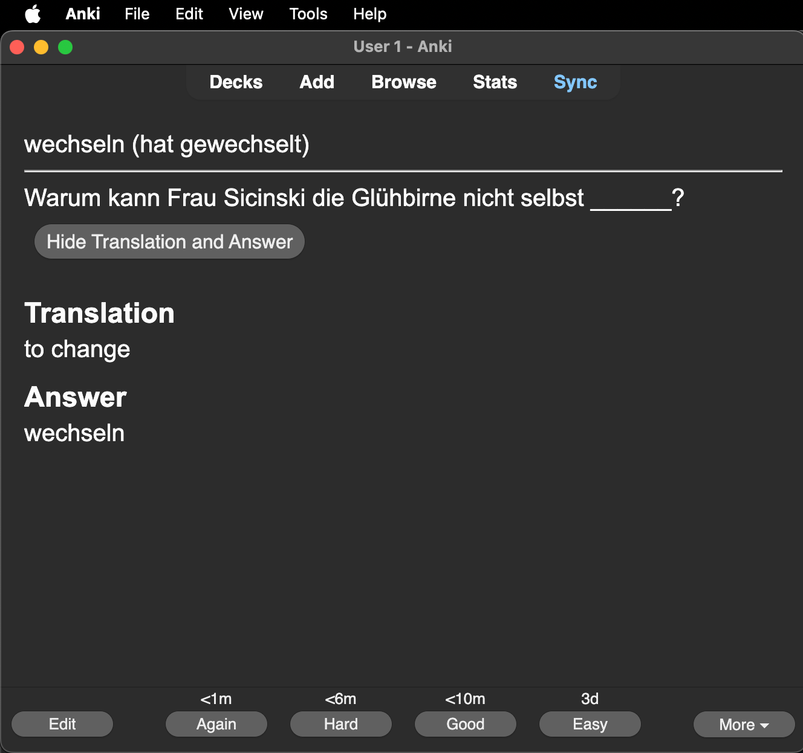

# Lernwortschatz aus Schritte Plus in Anki

## Überblick

In diesem Projekt wandeln wir den Lernwortschatz aus den Schritte Plus Lehrbüchern in Anki-Karteikarten um. So kannst du die Vokabeln leichter lernen und wiederholen.

## Ziel

Unser Ziel ist es, alle wichtigen Vokabeln aus den Schritte Plus Büchern digital verfügbar zu machen. Mit Anki kannst du diese Wörter effektiv üben, da es ein System zur intelligenten Wiederholung nutzt.

## Wie funktioniert es?

Wir haben die Wörter und Beispielsätze aus den Büchern gesammelt und in ein Anki-Deck gepackt. Jede Karte enthält:

1. **Wort**: Das deutsche Wort aus dem Buch.
2. **Übersetzung**: Die englische Bedeutung des Wortes.
3. **Beispielsatz**: Einen Satz aus dem Buch mit einer Lücke statt des Wortes.
4. **Antwort**: Das fehlende Wort im Satz.

## Anki-Deck herunterladen und nutzen

Du kannst das Anki-Deck (A2.1) [hier herunterladen](./data/A2.1_schritte_plus.apkg).

### Anleitung
1. **Anki installieren**: Wenn du Anki noch nicht hast, lade es von der [offiziellen Webseite](https://apps.ankiweb.net/) herunter und installiere es.
2. **Deck importieren**:
- Öffne Anki
- Klicke auf `Datei > Importieren`
- Wähle die heruntergeladene Datei [A2.1_schritte_plus.apkg](./data/A2.1_schritte_plus.apkg) aus
- Das Deck wird nun importiert
3. **Mit dem Lernen beginnen:**
- Wähle das neue Deck in Anki aus
- Klicke auf Lernen, um zu starten

### Beispielansichten

So sieht das Deck in Anki aus:

